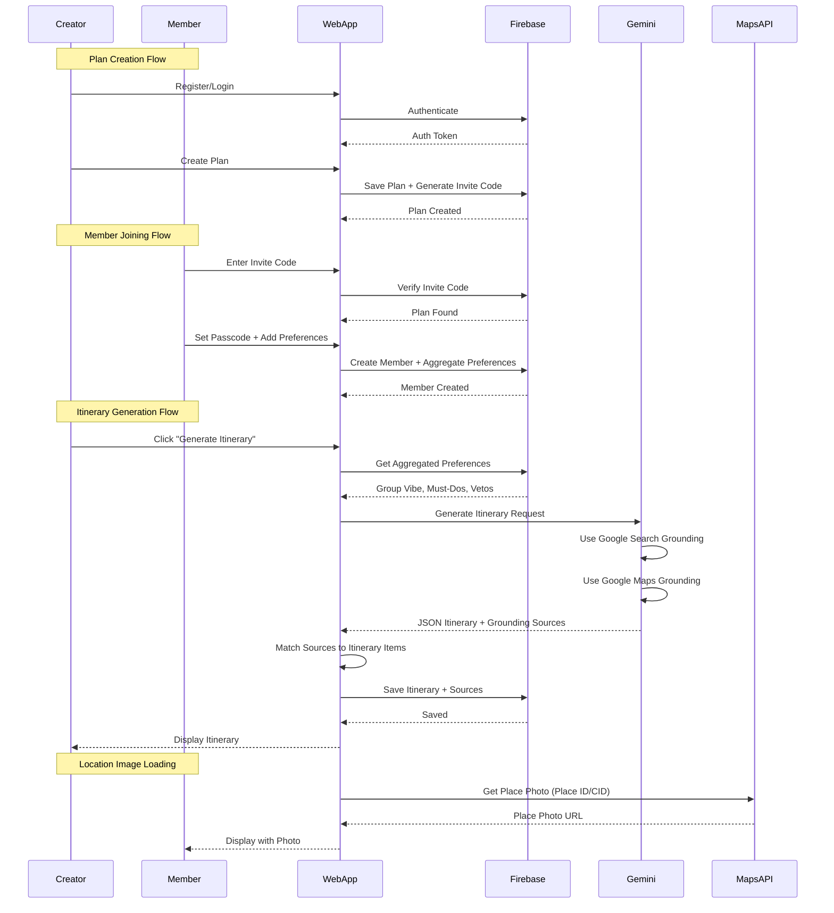
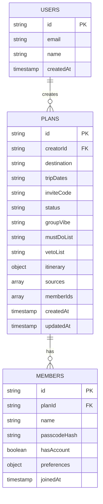
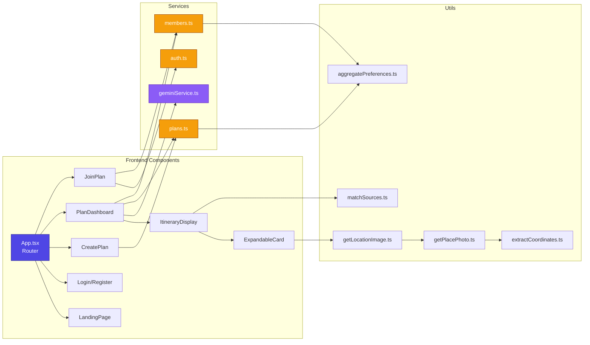
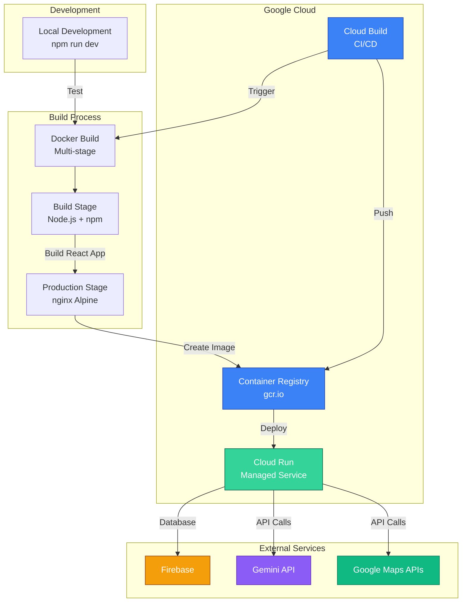
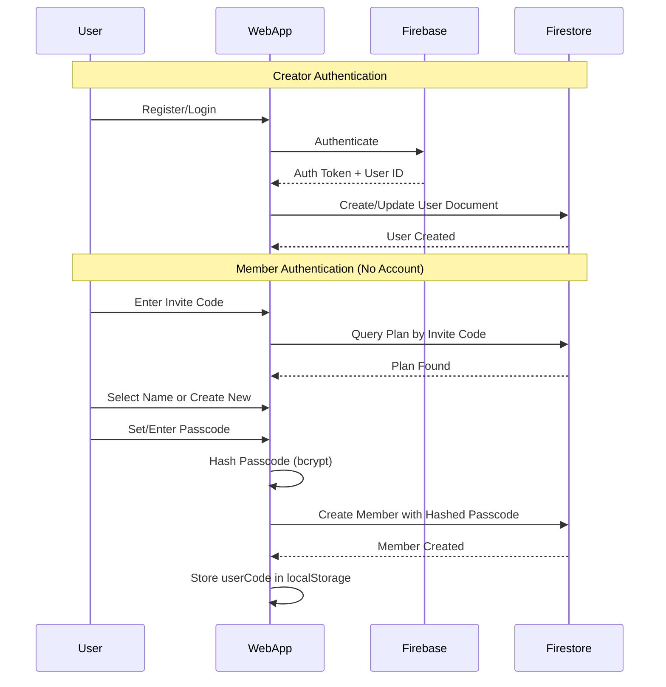
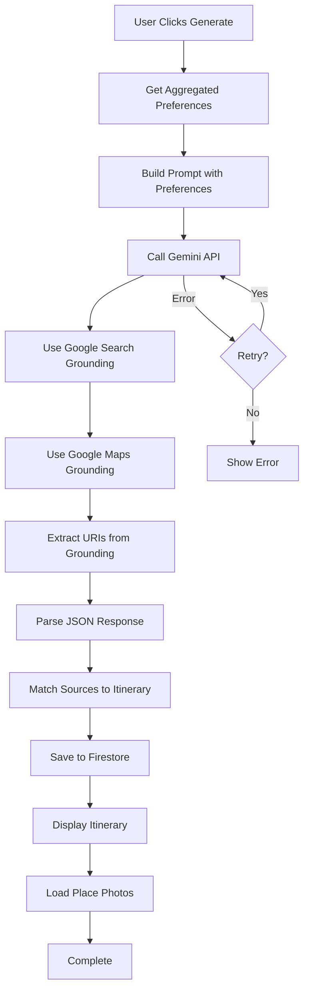

# Ryoko AI Trip Planner - Architecture Diagram

## System Architecture

```mermaid
graph TB
    subgraph "Client Layer"
        WebApp[React Web App<br/>TypeScript + Vite]
        Creator[Plan Creator]
        Member[Team Member]
    end

    subgraph "Google Cloud Run"
        CloudRun[Cloud Run Service<br/>nginx + Static Files]
    end

    subgraph "Firebase Services"
        Auth[Firebase Authentication]
        Firestore[(Firestore Database)]
        subgraph "Collections"
            Users[(users)]
            Plans[(plans)]
            Members[(members)]
        end
    end

    subgraph "Google AI Services"
        Gemini[Gemini 2.5 Pro API]
        MapsGrounding[Google Maps Grounding]
        SearchGrounding[Google Search Grounding]
    end

    subgraph "Google Maps Services"
        MapsJS[Google Maps JavaScript API]
        PlacesAPI[Google Places API]
        StaticMaps[Google Static Maps API]
        Geocoding[Google Geocoding API]
    end

    %% User interactions
    Creator -->|Create Account/Login| Auth
    Member -->|Join with Invite Code| WebApp
    Creator -->|Create Plan| WebApp
    Member -->|Add Preferences| WebApp

    %% Frontend to Cloud Run
    WebApp -->|Served via| CloudRun

    %% Frontend to Firebase
    WebApp -->|Authenticate| Auth
    WebApp -->|Read/Write| Firestore
    Auth -->|User Data| Users
    Firestore -->|Plan Data| Plans
    Firestore -->|Member Data| Members

    %% Itinerary Generation Flow
    WebApp -->|Generate Itinerary Request| Gemini
    Gemini -->|Search for Places| SearchGrounding
    Gemini -->|Get Location Details| MapsGrounding
    MapsGrounding -->|Return URIs & Data| Gemini
    SearchGrounding -->|Return Place Info| Gemini
    Gemini -->|JSON Itinerary + Sources| WebApp

    %% Maps Integration
    WebApp -->|Load Maps| MapsJS
    WebApp -->|Get Place Photos| PlacesAPI
    WebApp -->|Get Static Images| StaticMaps
    WebApp -->|Geocode Locations| Geocoding
    MapsGrounding -->|Place URIs| WebApp

    %% Data Flow
    WebApp -->|Save Itinerary| Plans
    WebApp -->|Save Member Data| Members
    WebApp -->|Real-time Updates| Firestore

    style WebApp fill:#4F46E5,stroke:#312E81,color:#fff
    style CloudRun fill:#34D399,stroke:#065F46,color:#fff
    style Auth fill:#F59E0B,stroke:#92400E,color:#fff
    style Firestore fill:#F59E0B,stroke:#92400E,color:#fff
    style Gemini fill:#8B5CF6,stroke:#5B21B6,color:#fff
    style MapsGrounding fill:#3B82F6,stroke:#1E40AF,color:#fff
    style SearchGrounding fill:#3B82F6,stroke:#1E40AF,color:#fff
    style MapsJS fill:#10B981,stroke:#047857,color:#fff
    style PlacesAPI fill:#10B981,stroke:#047857,color:#fff
```

## Data Flow Diagram

## Database Schema

## Component Architecture

## Deployment Architecture

## Authentication Flow

## Itinerary Generation Flow

